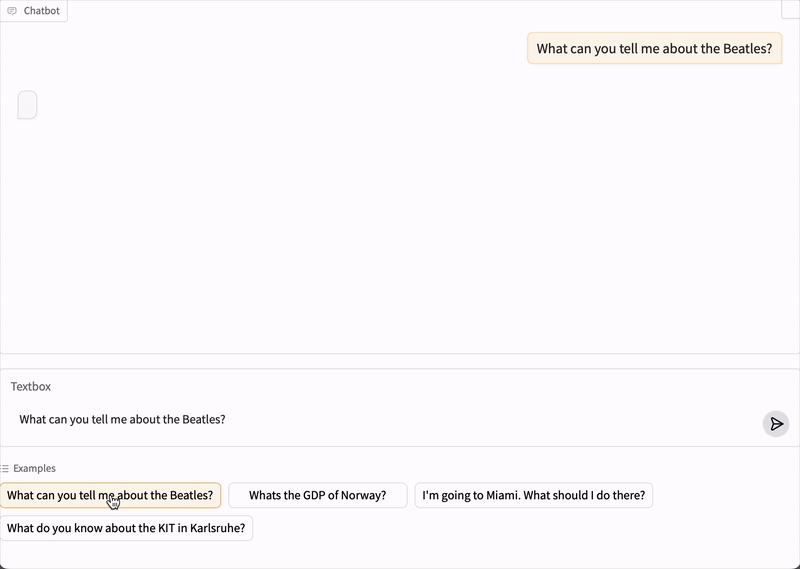
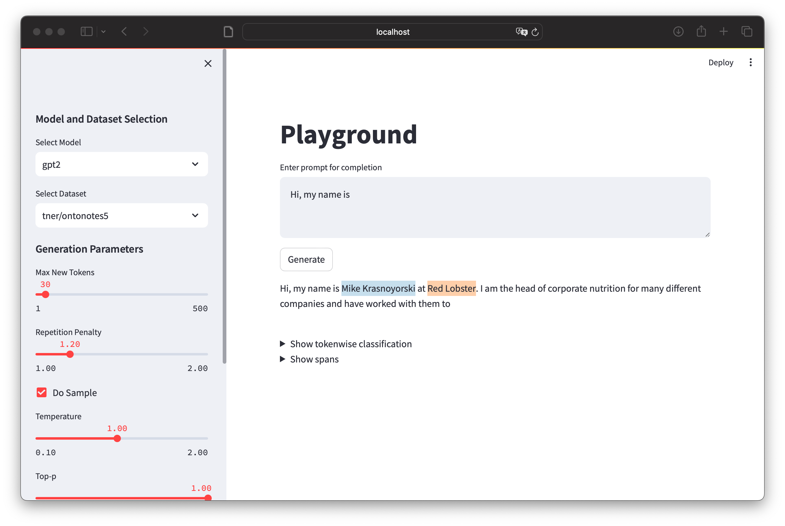

# STOKE: A Toolkit for Streaming Token Classification

[Related publication](https://ember.nicpopovic.com)

[Code for experiments](https://github.com/nicpopovic/EMBER)

## Installation
You can use pip to install the required dependencies:
```
python3 -m venv venv
source venv/bin/activate
pip install -r requirements.txt
```
## Training Procedure
Example of a data generation and training procedure
```
# first, create an annotated dataset using an auxiliary model
python generate_instruct.py --language_model meta-llama/Llama-3.2-3B-Instruct --cuda

# train probes for layers 20-27, while pointing to the the dataset created above
python example_train.py --path 'data/meta-llama/Llama-3.2-3B-Instruct/STOKE_500_wikiqa' --layers 20 21 22 23 24 25 26 27 --batch_size 4 --cuda
```

## Chat Demo
You can download trained probes for Llama-3.2-1B-Instruct [here](https://drive.google.com/drive/folders/1tjLaZMggFvcmala5wglgRlSRQlvnYJgQ?usp=share_link). More pre-trained models will be added soon!

In order to launch the chat demo (shown below):
```
export HF_TOKEN="your token here..."
python chat.py
```



## Playground
In order to launch the playground (shown below):
```
streamlit run stoke/src/playground/app.py
```



## Transformers fork

In order to easily use the streaming classifiers, this repo makes use of a [custom fork of transformers.](https://github.com/nicpopovic/transformers/tree/4.45-STOKE)
